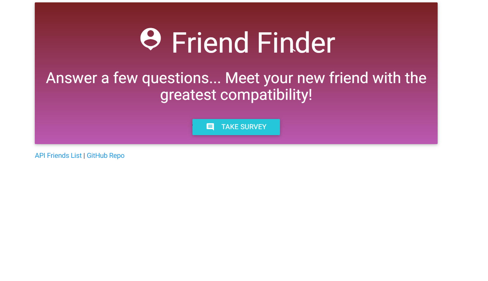
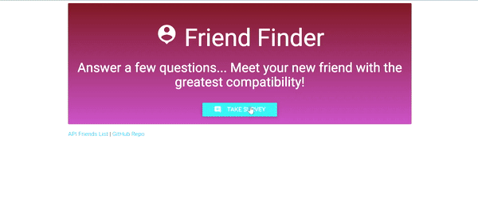

# friendfinder
matches friends based similar interest using node-express for routing

# FriendFinder

Friend Finder app (essentially a dating app but for friends) using Node and Express servers. The user enters the page that leads to a survey. When the user submits the survey, they are matched with a "friend" that has the closest match to their personality.

## see it in action
https://whispering-basin-92756.herokuapp.com/

## this app uses
- Node.js
- express NPM Package - https://www.npmjs.com/package/express
- path NPM Package - https://www.npmjs.com/package/path

* **Jon Finley**  [GitHub](github.com/JonFinley211)
